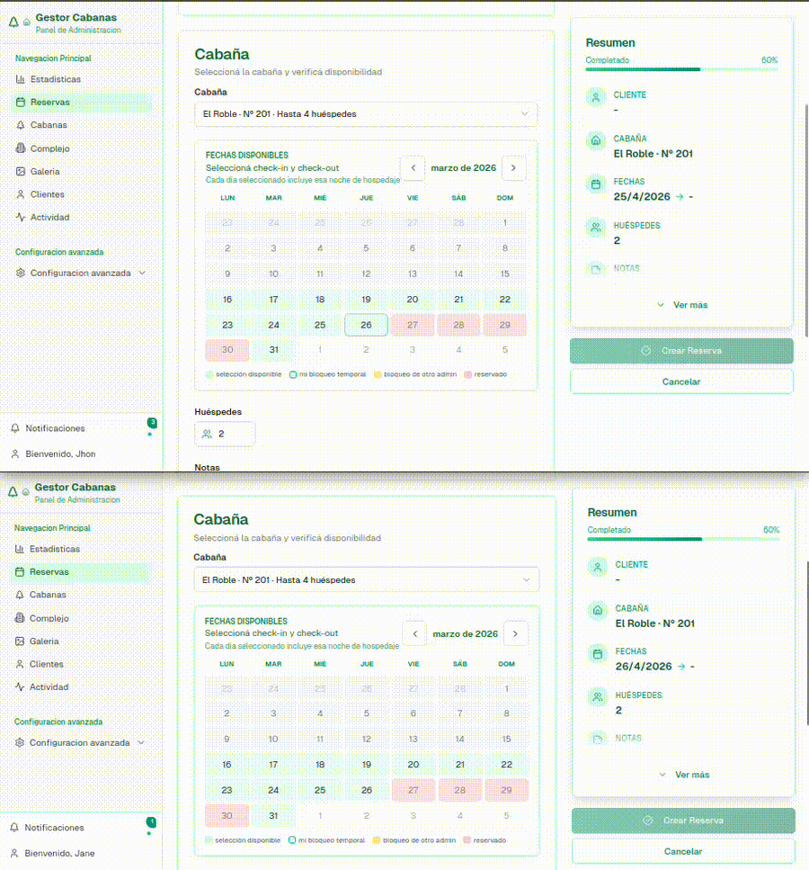
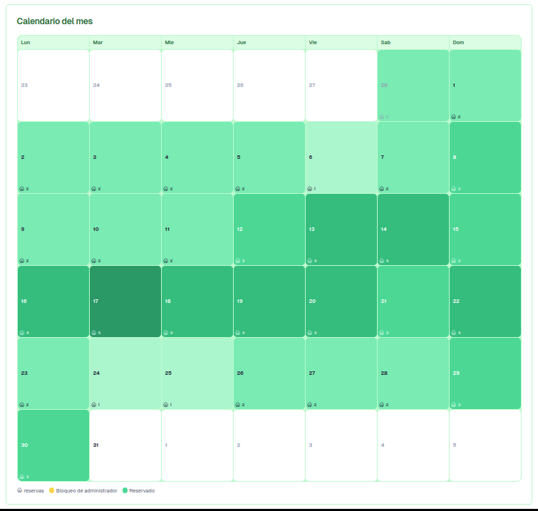
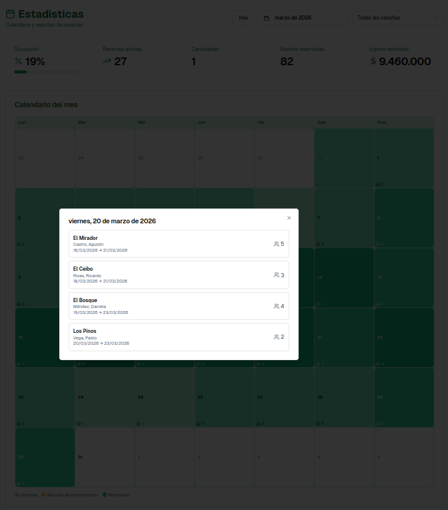
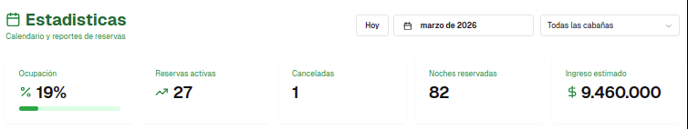
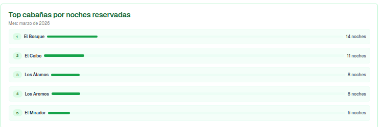
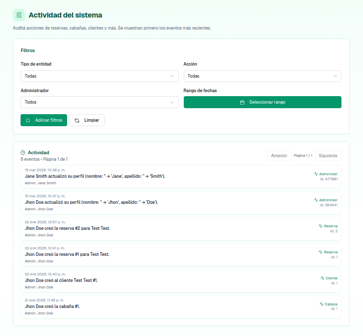
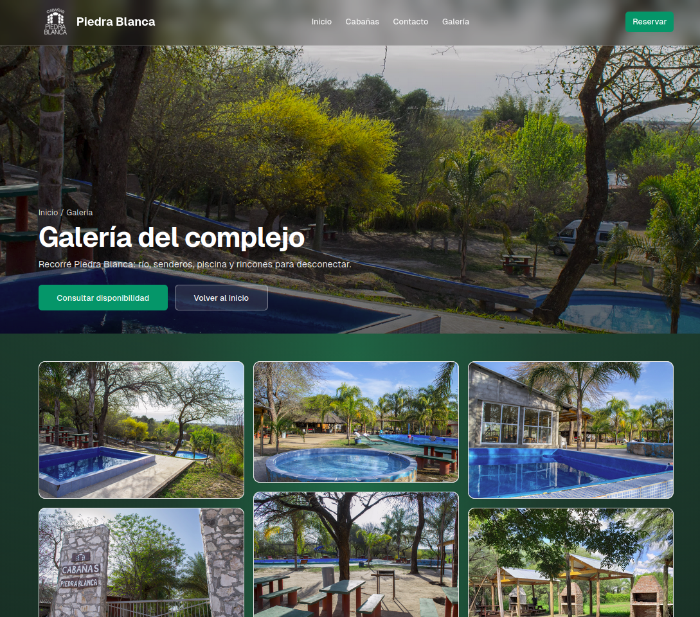
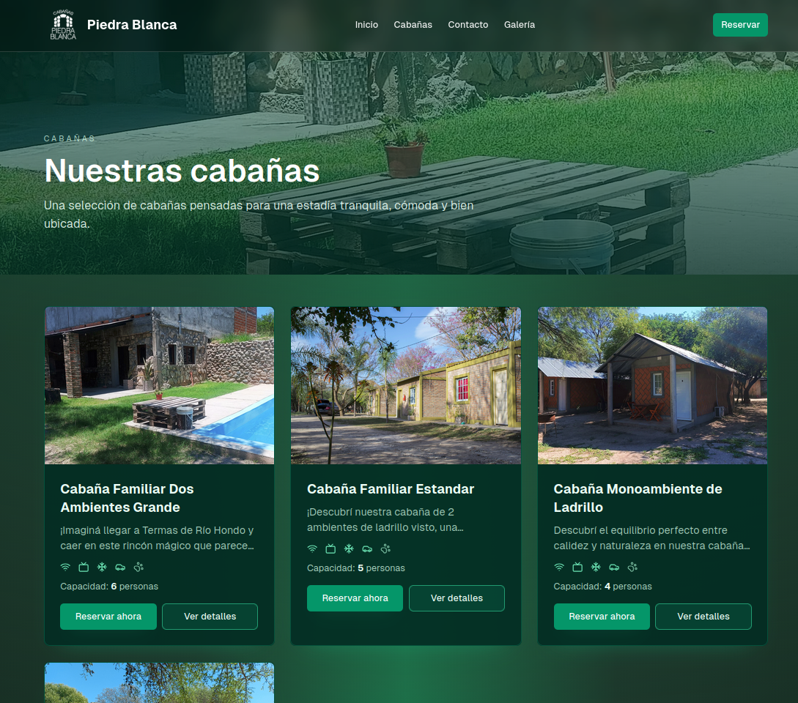
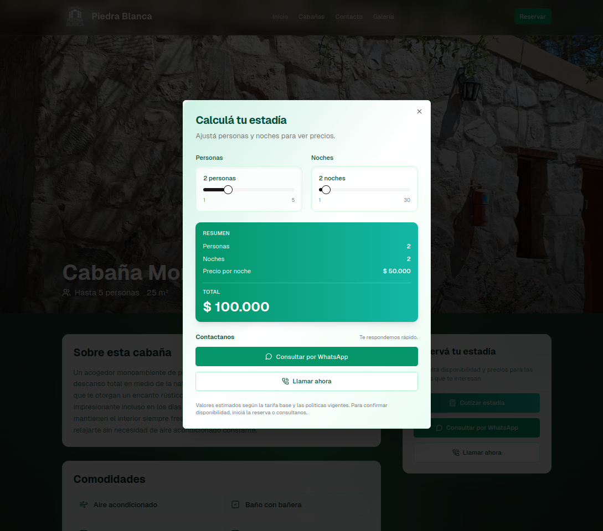

# Reservation Platform

Reservation platform architecture designed to support different booking domains such as cabins, hotels, rentals and other reservation-based businesses.

The platform provides a **policy-driven reservation engine**, real-time coordination between administrators, operational analytics, and production-grade deployment workflows.

It is currently deployed in production as a **cabin reservation and management system**, while its architecture is designed to support a generalized **multi-tenant, multi-domain reservation platform** capable of serving multiple booking models.

---

# Overview

Reservation systems vary significantly depending on the domain:

* cabins and hotels operate with **check-in / check-out rules**
* tours and activities operate with **time slots**
* equipment rentals use **time intervals**
* other domains may require **custom booking constraints**

This project addresses those differences by separating the **core reservation engine** from the **domain-specific policies** that define how reservations behave.

The platform provides a **policy-driven reservation system** capable of adapting to different booking models without rewriting the core application logic.

The result is a backend platform that can support multiple businesses while maintaining a single codebase.

---

# Live System Demonstration

The following sections show the system currently running in production as a **cabin reservation platform**.

---

## Real-time reservation coordination

The system prevents double bookings by coordinating administrators in real time.

When an admin starts interacting with a reservation resource:

* the resource is temporarily **locked**
* other administrators **see the interaction in real time**
* concurrent conflicting edits are prevented

This coordination is implemented using **WebSockets**.

Example scenario demonstrated in the GIF:




```

Admin A begins creating a reservation
Admin B instantly sees the reservation slot locked
Concurrent conflicts are prevented in real time

```

This mechanism prevents overlapping reservations when multiple administrators work simultaneously.

---

## Reservation calendar

Administrators manage reservations through an **interactive calendar interface** that displays system occupancy using a heatmap.

The calendar provides an immediate overview of:

* occupancy levels
* reservation density
* available and reserved dates



---

## Daily reservation details

Selecting a specific day in the calendar opens a detailed view listing the reservations affecting that date.

This allows administrators to quickly inspect:

* which units are reserved
* guest information
* reservation intervals
* occupancy levels



---

## Operational statistics dashboard

The system includes a dashboard providing operational insights such as:

* occupancy percentage
* active reservations
* canceled reservations
* nights reserved
* estimated revenue

These statistics help administrators monitor business performance.



---

## Reservation analytics

The platform also provides additional analytics such as **top-performing units by reserved nights**, helping operators understand usage patterns and demand distribution.



---

## Activity audit log

All relevant actions performed in the system are logged for **operational auditing and traceability**.

The audit log records:

* the administrator who performed the action
* the entity affected
* the action executed
* timestamps and metadata

This allows operators to trace system activity and investigate operational changes.



---

## Public website

The system also includes a **public-facing website** used by the business to present its services.

The website provides:

* information about available units
* images and descriptions
* contact information
* map integrations
* pricing estimation



---

## Unit catalog

Visitors can browse available units through a visual catalog including:

* images
* descriptions
* amenities
* occupancy capacity



---

## Reservation estimation

The public site includes a **pricing estimator** allowing visitors to simulate their stay.

Users can adjust:

* number of guests
* number of nights

The system dynamically calculates estimated pricing based on configured policies.



---

# Key Concepts

## Multi-tenant architecture

The platform is designed so multiple businesses can use the same backend system while keeping their data isolated.

Example tenants:

```

Tenant A → cabin resort
Tenant B → hotel
Tenant C → equipment rental
Tenant D → activity booking

```

Each tenant operates independently while sharing the same infrastructure and application logic.

---

## Policy-driven reservation engine

Different booking domains require different reservation rules.

Instead of hardcoding those rules into the system, the platform introduces a **policy layer** that defines how reservations behave for each domain.

Examples of domain policies:

* nightly stays (cabins, hotels)
* time-slot reservations (activities)
* interval-based rentals (equipment)
* custom booking restrictions

The reservation engine executes the booking logic using these policies, allowing the system to support multiple domains without duplicating business logic.

---

# Core Capabilities

## Domain-driven reservation states

Reservations follow a **state model** with business rule validation.

Examples:

* reservations automatically transition to **absent** if check-in is not performed before the configured time
* finished reservations cannot change state
* reservation periods can be extended or shortened only when availability rules allow it

This logic ensures the system enforces the operational rules of the business domain.

---

## Push notifications

The system supports browser-based push notifications.

Administrators can subscribe their devices to receive notifications even when the application is not open.

Notifications are delivered using the browser Push API and handled by a Service Worker running on the client device.

This allows the system to notify administrators about relevant events without requiring the web application to remain open.

---

## Public website and administration dashboard

The platform exposes two different user surfaces.

### Public website

Businesses can publish:

* contact information
* available units
* descriptions and images
* phone numbers and addresses
* map integrations

This allows the system to function not only as a management tool but also as a **public-facing site for the business**.

### Administration dashboard

The admin interface provides tools for:

* managing units
* managing clients
* creating reservations
* monitoring availability through an interactive calendar
* reviewing operational statistics

---

## Progressive Web App (PWA)

The web application can be installed as a **Progressive Web App**, allowing administrators to use the system as a native-like application on supported devices.

---

## Architecture

```


               ┌─────────────────────────────┐
               │         End Users           │
               │  Guests / Admin Operators   │
               └──────────────┬──────────────┘
                              │
          ┌───────────────────┴───────────────────┐
          │                                       │
          ▼                                       ▼
┌──────────────────────────┐            ┌──────────────────────────┐
│      Public Website      │            │     Admin Dashboard      │
│  business info, units,   │            │ reservations, calendar,  │
│ contact, maps, content   │            │ clients, stats, config   │
└──────────────┬───────────┘            └──────────────┬───────────┘
               │                                       │
               └───────────────────┬───────────────────┘
                                   │
                                   ▼
                    ┌─────────────────────────────┐
                    │    Reservation Platform     │
                    │            API              │
                    ├─────────────────────────────┤
                    │ Multi-tenant core           │
                    │ Policy-driven booking logic │
                    │ Reservation engine          │
                    │ Domain validations/states   │
                    │ Auth / users / roles        │
                    │ Notifications               │
                    └──────────────┬──────────────┘
                                   │
          ┌────────────────────────┼────────────────────────┐
          │                        │                        │
          ▼                        ▼                        ▼
┌──────────────────────┐  ┌──────────────────────┐  ┌──────────────────────┐
│ Real-time Coord.     │  │ Background Workers   │  │   Public / Admin     │
│ WebSockets locks     │  │ push notifications   │  │    application       │
│ concurrent edits     │  │ async processing     │  │      services        │
└──────────────────────┘  └──────────────────────┘  └──────────────────────┘
                                   │
                                   ▼
                        ┌──────────────────────┐
                        │      PostgreSQL      │
                        │ tenants, units,      │
                        │ clients, reservations│
                        │ policies, states     │
                        └──────────────────────┘

```

Both the public site and admin dashboard interact with the same **Reservation Platform API**, which centralizes:

* multi-tenant data isolation
* reservation rules through policies
* real-time coordination via WebSockets
* background processing through workers
* domain validation and automated state transitions

The current production deployment uses this architecture for a **cabin reservation business**, while the core design is prepared to support additional booking domains in the future.

---

# CI/CD Pipeline

The system is deployed using an automated pipeline built around Docker and GitHub Actions.

```

Backend repo   ──► GitHub Actions ──► Docker image ──► GHCR ──┐
Frontend repo  ──► GitHub Actions ──► Docker image ──► GHCR ──┼──► Infra pipeline ──► VPS deploy
│
Infra repo     ───────────────────────────────────────────────┘
├─ health checks
├─ firewall hardening
└─ production rollout

```

Infrastructure responsibilities include:

* automated deployment
* container orchestration
* health checks
* firewall hardening
* production monitoring

---

# Tech Stack

## Backend

* C#
* .NET 8
* ASP.NET Core Web API
* Entity Framework Core
* PostgreSQL
* WebSockets

## Frontend

* Next.js
* React
* TypeScript
* Progressive Web App support

## Infrastructure

* Docker
* GitHub Actions
* GitHub Container Registry (GHCR)
* VPS deployment

---

# Repository Structure

The production system is composed of multiple repositories:

```

backend
frontend
infrastructure

```

Due to the system being deployed in a live production environment, the operational repositories remain private.

This repository documents the **architecture, design decisions and deployment model** of the platform.

---

# Operational Infrastructure

The production deployment includes automated operational tooling to ensure safe database operations.

Backups and restore procedures are handled using **pgBackRest**, integrated with Docker Compose and automated through a custom operations toolkit.

Key capabilities include:

* automated snapshot backups
* restore-to-new-volume workflows
* shadow validation before promotion
* controlled production cutovers
* rollback-friendly restore procedures

To standardize and simplify these operations, I developed a dedicated Bash toolkit which is now maintained as an open-source project:

**pgbackrest-compose-ops**  
https://github.com/uri157/pgbackrest-compose-ops

---

# Operational Guarantees

### Automated Backups

The database is backed up automatically using **pgBackRest**, with snapshot backups scheduled on the VPS through systemd timers.

### Safe Restore Procedures

Database restores follow a **restore-to-new-volume strategy**, avoiding in-place overwrites of production data.

A restored instance can be validated before promotion to ensure the integrity of the backup.

### Controlled Cutover and Rollback

Production database switches are performed through controlled volume changes, allowing:

* validation before promotion
* fast rollback to the previous volume if necessary

### Health Monitoring

The deployment pipeline includes health checks to verify that application containers are running correctly after deployment.

---

# Engineering Tooling

During the development and operation of this system, some internal operational tools proved robust enough to be extracted and published as standalone open-source projects.

These tools were originally built to solve real production problems encountered while operating this platform.

---

### compose-vps-deploy

Deterministic deployment toolkit for Docker Compose workloads on a VPS.

It provides a structured deploy pipeline including:

* preflight validation
* container image deployment
* migration execution
* container recreation
* post-deploy health verification

Repository:  
https://github.com/uri157/compose-vps-deploy

---

### pgbackrest-compose-ops

Operational toolkit for safe PostgreSQL backup and restore procedures using pgBackRest in Docker Compose environments.

Key capabilities include:

* automated snapshot backups
* restore to a new volume
* shadow validation before promotion
* controlled production cutover
* rollback-friendly restore procedures

Repository:  
https://github.com/uri157/pgbackrest-compose-ops

---

These tools emerged directly from operating the reservation platform in production and are now maintained as reusable open-source utilities.

---

# Project Origins

The platform originally started as a **cabin management system built for a real client** during a university software engineering project.

The development team consisted of **four developers working under a Scrum process**, supervised by two senior engineers:

* one focused on **software engineering practices, UI, and client interaction**
* one focused on **technical architecture**

During the project:

* I initially served as **Scrum Master**
* over time I naturally adopted the **Product Owner role**, becoming the main communication channel with the client

After the academic project finished, I continued maintaining and evolving the system in production.

The architecture implemented during that project allowed the system to grow beyond its original scope and evolve into a **general-purpose reservation platform**.

---

# Future Evolution

The platform is currently evolving toward a fully generalized **multi-tenant reservation platform**, capable of supporting additional booking domains and customizable reservation policies.

